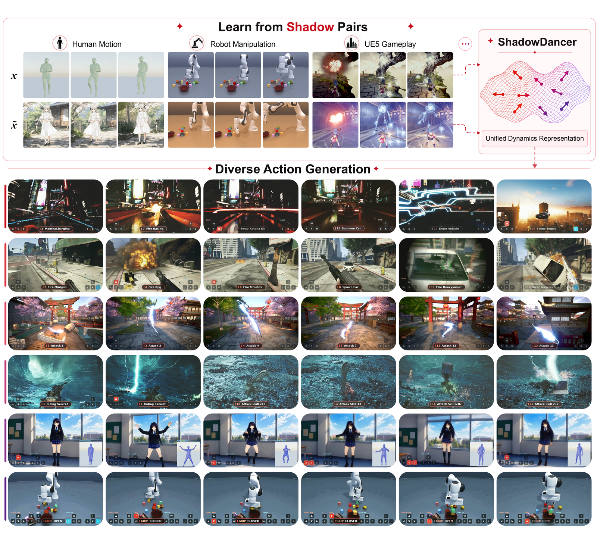

<h1 align="center">
  &nbsp;ShadowDancer
</h1>

<p align="center"><b>Teaching Video World Models Any Action from a Video and Its Shadow</b></p>

<div align="center">

[](https://shadowdancer-1.github.io/)
[](https://arxiv.org/abs/2607.28362)
<!-- [](TODO_hf_url) -->

</div>

> #### [ShadowDancer: Teaching Video World Models Any Action by Learning Unified Dynamics Representations from a Video and Its Shadow](https://arxiv.org/abs/2607.28362)
>
> ##### [Jin Cao](https://jin-cao-tma.github.io/), Zian Meng, [Kaipeng Zhang](https://kpzhang93.github.io/)&dagger;  (&dagger; corresponding author)

<p align="center">
  
</p>

ShadowDancer gives interactive video world models an **any-action, frame-level control**.

The code and model weights are being cleaned up and are undergoing internal review before release.🚧 

## Citation

```bibtex
@misc{cao2026shadow,
  title={ShadowDancer: Teaching Video World Models Any Action by Learning Unified Dynamics Representations from a Video and Its Shadow},
  author={Jin Cao and Zian Meng and Kaipeng Zhang},
  year={2026},
  eprint={2607.28362},
  archivePrefix={arXiv},
  primaryClass={cs.CV},
  url={https://arxiv.org/abs/2607.28362},
}
```
